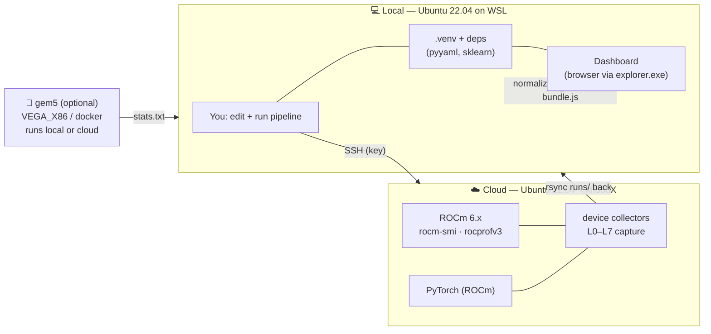
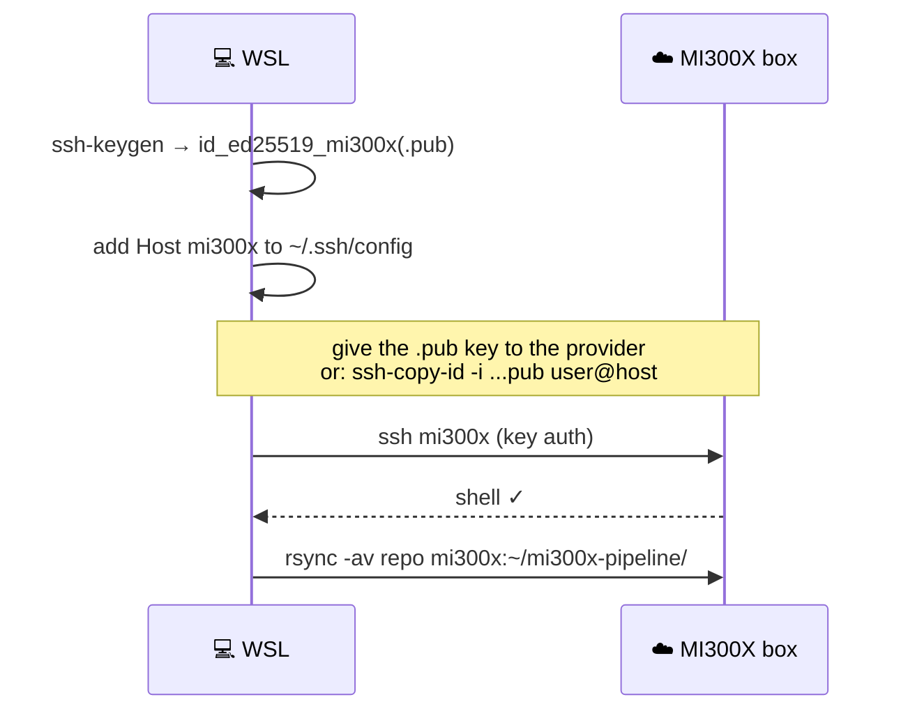
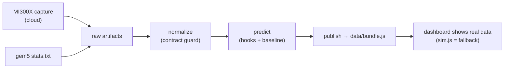

# Installation & Setup Guide

Setup for the MI300X / gem5 metrics pipeline across **two machines**: your local
**Ubuntu 22.04 on WSL** (where you develop, run the normalize/predict/dashboard
side, and view results) and a **cloud box with the AMD MI300X** (where real
captures run). gem5 is optional and can run on either.

> **Confirmed target box:** AMD Instinct MI300X (OAM), **ROCm 7.0.0**, amdgpu
> 6.16.13, **`amd-smi` 26.0.0**, baremetal, SPX/NPS1, 196 GB, often accessed as
> **root** via a Jupyter terminal. The collectors prefer `amd-smi` (ROCm 7) and
> fall back to `rocm-smi`; as root no group/sudo setup is needed.

> Every script is idempotent (safe to re-run) and lives in `scripts/`. View this
> file on GitHub or in VS Code's Markdown preview to see the Mermaid diagrams.

## 1. Topology



## 2. Setup order — which script, where

```mermaid
flowchart TD
    A["① scripts/01_setup_local_wsl.sh<br/><i>on WSL</i>"] --> B["② scripts/00_setup_ssh.sh<br/><i>on WSL — make SSH key + ~/.ssh/config</i>"]
    B --> C{"Get cloud access<br/>(paste public key)"}
    C --> D["③ rsync repo to cloud<br/><i>rsync -av repo mi300x:~/mi300x-pipeline/</i>"]
    D --> E["④ scripts/02_setup_cloud_mi300x.sh<br/><i>on cloud — ROCm deps + PyTorch-ROCm</i>"]
    E --> F["⑤ python orchestrator.py (mode: device)<br/><i>on cloud — real capture</i>"]
    F --> G["⑥ rsync runs/ back to WSL"]
    G --> H["⑦ python orchestrator.py + open dashboard<br/><i>on WSL — normalize/predict/view</i>"]

    A -. optional .-> X["scripts/03_setup_gem5.sh --docker<br/><i>gem5 path</i>"]
    style A fill:#1a2231,stroke:#00C2B2
    style E fill:#1a2231,stroke:#ED1C24
    style H fill:#1a2231,stroke:#39D353
```



Run `scripts/preflight.sh` on either box anytime to see what's installed and
which collectors will work.

## 3. Local WSL setup

```bash
# in WSL, from the repo:
cd mi300x-pipeline
bash scripts/01_setup_local_wsl.sh
```
This installs Python + a venv, the pipeline deps, runs the fixture demo, and
publishes data the dashboard can show. Then view it:

```bash
cd ../mi300x-dashboard && explorer.exe index.html     # opens in your Windows browser
# or: python3 -m http.server 8000  → http://localhost:8000
```

## 4. SSH to the cloud MI300X

```bash
bash scripts/00_setup_ssh.sh --host <CLOUD_IP> --user ubuntu --alias mi300x
```



The script prints your public key — paste it into the provider's console (or
`authorized_keys`). Then `ssh mi300x` should just work.

## 5. Cloud MI300X setup

Get the repo onto the box (Jupyter box → `git clone`; or `rsync` from WSL), then:
```bash
# in the Jupyter terminal / ssh session on the MI300X box:
cd ~/mi300x-pipeline          # (git clone <repo> ~/mi300x-pipeline  if not there yet)
bash scripts/02_setup_cloud_mi300x.sh   # verifies amd-smi/ROCm 7, installs deps, checks torch
```
On this box you're **root on ROCm 7**, so: no `render/video` group step, no
re-login, and `amd-smi` is the SMI tool. Most MI300X images already ship a
ROCm-built PyTorch — the script keeps it if present (only installs if missing).
Add `--install-rocm` only if `rocminfo` is absent (rare).

### Isolated box (wget / git / pip work, but no apt or sudo)

This matches the confirmed environment. The script's `apt` steps are **non-fatal
and auto-skip**; it installs deps with `pip` (venv if available, else `--user`)
and you bring the repo in with `git clone`. No internet wheelhouse needed. Exact
sequence:

```bash
git clone <your-repo-url> ~/mi300x-pipeline      # wget/git allowed
cd ~/mi300x-pipeline
pip install -r requirements.txt                  # core: pyyaml (+ sklearn/numpy)
python -c "import torch; print(torch.__version__, torch.cuda.is_available())"  # keep image's torch
bash scripts/preflight.sh                        # confirm amd-smi / rocprofv3 / torch
bash scripts/02_setup_cloud_mi300x.sh            # apt steps skip, pip/torch handled
```
If `pip` needs a flag in your sandbox, `pip install --user -r requirements.txt`
also works. Do **not** reinstall torch if `cuda.is_available()` is already `True`.
Then run a real capture and copy results back:
```bash
# on cloud:
python orchestrator.py --config pipeline.device.yaml    # mode: device
# on WSL:
rsync -av mi300x:~/mi300x-pipeline/runs/ ./runs/
```

## 6. gem5 (optional)

```bash
bash scripts/03_setup_gem5.sh --docker          # easiest: prebuilt GPU image
# or build from source (45+ min):
bash scripts/03_setup_gem5.sh --build --jobs $(nproc)
```

## 7. End-to-end data flow



## 8. Troubleshooting

| Symptom | Fix |
|---|---|
| `ssh mi300x` asks for password | public key not on the box → `ssh-copy-id -i ~/.ssh/id_ed25519_mi300x.pub user@host` |
| `rocm-smi: command not found` (cloud) | ROCm 7 uses **`amd-smi`** — collectors prefer it automatically; verify with `amd-smi monitor`. Only `--install-rocm` if `rocminfo` is also missing |
| `torch` ROCm wheel mismatch on ROCm 7 | the box likely ships torch — keep it. If installing yourself, set `TORCH_ROCM_INDEX=https://download.pytorch.org/whl/rocm6.4` (closest stable) before `02_*.sh` |
| rocprofv3 permission denied | not in `render,video` groups, or need sudo for HW counters → re-login; run privileged collectors with sudo |
| dashboard shows simulated data | `data/bundle.js` missing → run `python orchestrator.py`; check browser console for `[data.js] MI300X_DATA loaded` |
| `torch.cuda.is_available()` is False on MI300X | you installed the CUDA wheel → reinstall from the ROCm index (see `requirements.txt`) |
| gem5 GPUFS won't boot in WSL | GPUFS needs KVM (`kvm-ok`); use GPUSE in WSL, or build/run gem5 on the cloud box |

See `README.md` for architecture and `RUNBOOK.md` for the full operational runbook.
