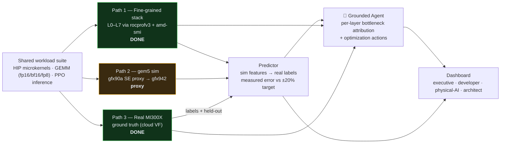
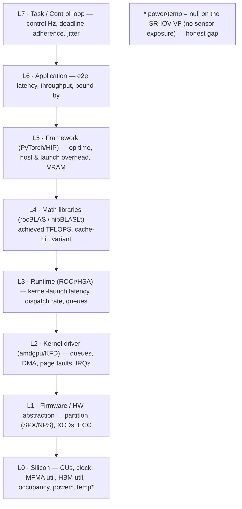
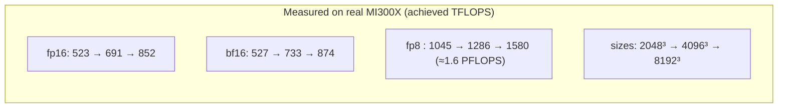
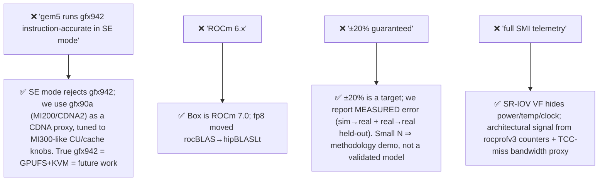
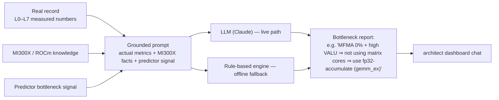
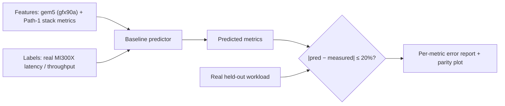
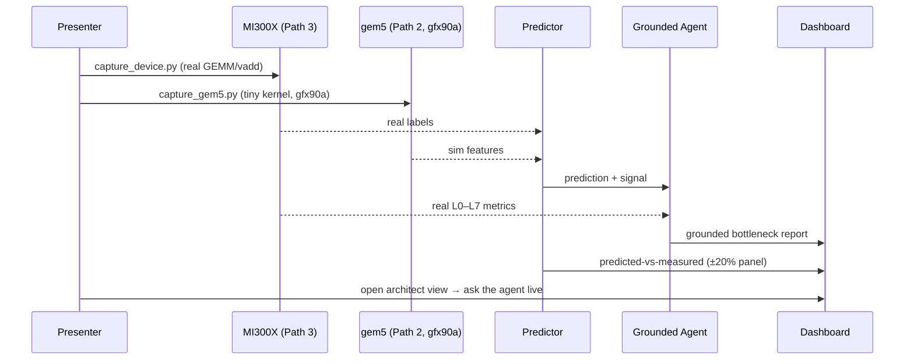

# Grounded-Agentic Sim-to-Real Profiling for AMD MI300X
### Closing the Physical-AI Simulation→Real gap with a hardware-grounded agentic benchmarking suite

**Status:** Refined for feasibility · June 2026 · target: AMD ROCm 7.0 + Instinct MI300X (CDNA 3 / gfx942)

> This is the feasibility-corrected version of `my-objectives/proposal-extension.md`, grounded in
> what we actually built and measured this week. Claims that didn't survive contact with the
> hardware (e.g. gem5 instruction-accurate gfx942 in SE mode) are corrected here and clearly flagged.

---

## 1. The problem — two gaps at once

**The simulation→real gap (Physical AI).** A robot control policy that behaves fine in a functional
simulator tells you *nothing* about whether it will meet its **real-time deadline** on the deployed
accelerator. Missing a control deadline isn't a dropped frame — it can be a robot crossing a street
a second too late. Validating this today means buying every candidate GPU: slow, costly, late.

**The generative-AI reliability gap.** Generic LLMs give plausible-but-ungrounded hardware advice.
For precision engineering ("why is my kernel slow on MI300X, and what do I change?") that's not good
enough — the answer has to be tied to *this device's measured behaviour*.

## 2. The solution — a 3-path suite + a hardware-grounded agent

We measure a shared workload suite along **three paths**, fuse them into a **predictor**, and layer a
**grounded agent** on top that explains *where* the bottleneck is and *what* to change — citing the
device's own numbers.

## 3. The three paths (with honest status)

| Path | What it produces | Tools | Status |
|---|---|---|---|
| **1 — Fine-grained stack** | L0–L7 metrics per workload (compute/mem util, MFMA, cache-hit, occupancy, latency) | `rocprofv3` HW counters, `amd-smi` | ✅ **Done** — 29 real records |
| **2 — Architectural sim** | cycle/cache/occupancy from a simulated CDNA GPU, no hardware needed | gem5 25.1 (VEGA_X86), `apu_se.py` | ⚠️ **gfx90a proxy** (see §5) |
| **3 — Real ground truth** | measured latency / throughput on the actual device | real MI300X (cloud SR-IOV VF) | ✅ **Done** |

**Layer model (L0→L7)** captured by Path 1:

## 4. Real results already captured (Path 1 + 3)

A real GEMM precision/size sweep on the MI300X — the credibility anchor:

- fp8 (hipBLASLt) ≈ **1.7× fp16**, compute-bound, MFMA engaged — the MI300X precision advantage, measured.
- vadd is memory-bound (MFMA 0%); GEMM is compute-bound (L2-hit ~70%) — physically consistent, end-to-end through the L0–L7 pipeline.

## 5. Feasibility corrections (what changed from the original proposal)

These corrections are the point of a good benchmarking suite: it reports **what the hardware/sim can
actually observe**, and flags every gap (`measured` / `derived` / `synthetic` / `null`) rather than
fabricating numbers.

### Scope decision: present the gfx90a proxy as-is (GPUFS/MI300 = future work)
We deliberately scope Path 2 to the **gfx90a (MI200/CDNA2) SE-mode proxy** and present it as such.
True gfx942 simulation requires gem5 **GPUFS + KVM**, which the SR-IOV VF does not provide; chasing
it would risk the demo for marginal gain. This is the honest, defensible choice — the *methodology*
(sim features → real estimate, grounded agent on the gap) is identical regardless of the simulated
ISA; only the absolute fidelity of Path 2 changes, and we say so.

**Presenter talking points (when asked "why not real MI300 in gem5?")**
- "gem5 models AMD GPUs; SE mode tops out at gfx90a, and gfx942 needs full-system + KVM, which a
  virtualized cloud GPU doesn't expose. So we use gfx90a as a **CDNA proxy** and label every gem5
  record `proxy: gfx90a→gfx942`."
- "It doesn't change the **method** — the predictor maps *whatever* sim/architectural features we
  have to real labels, and the agent reasons over the *real* MI300X numbers. The proxy only affects
  Path-2 absolute fidelity, which we report transparently."
- "Our strongest prediction result is **real→real**: achieved efficiency of an *unseen* config to
  ~10% MAE — that needs no gem5 at all and is fully validated on the MI300X."
- "GPUFS/MI300 is a clean next step on a KVM-capable node; the pipeline already emits the same
  record schema, so it's a drop-in once the simulator fidelity is available."

## 6. The grounded agent — generative-AI reliability via hardware grounding

The agent reads a record's **real L0–L7 numbers** + the predictor signal + MI300X knowledge, and
returns **per-layer bottleneck attribution + concrete actions**. Reliability comes from *grounding*:

- **Grounded vs ungrounded contrast** is the demo: the agent cites *measured* numbers
  (e.g. "memUtil 36% > computeUtil 3% ⇒ memory-bound; raise arithmetic intensity"), where a generic
  model would hand-wave.
- **Real-LLM + rule-based fallback**: live Claude when a key is present; a deterministic rule engine
  guarantees the agent always answers offline during the demo.

## 7. Sim→real prediction (the methodology)

Two complementary demonstrations: **sim→real** (gem5 proxy features → real labels) and **real→real
held-out** (predict an unseen size/precision from the rest of the real sweep — stronger signal given
the gfx90a fidelity gap).

## 8. What's built vs remaining (hackathon, 3–5 days)

```mermaid
gantt
    title Execution plan
    dateFormat X
    axisFormat %s
    section Done
    Path 1+3 real capture (29 records)      :done, d1, 0, 1
    gem5 built (VEGA_X86, /workspace/shared) :done, d2, 0, 1
    Dashboards + analysis figures            :done, d3, 0, 1
    section To build
    A · gem5 gfx90a real records             :a1, 1, 1
    B · sim→real + real→real predictor       :a2, 2, 1
    C · grounded agent (LLM + rule fallback) :a3, 3, 1
    D+E · proposal, wiring, demo runbook      :a4, 4, 1
```

## 9. Expected results & business value

- **Earlier, cheaper hardware decisions** — deployment performance becomes a simulation-time discovery.
- **De-risked deployment** — real-time deadline violations caught before integration on the robot.
- **Reliable, hardware-specific AI guidance** — the grounded agent turns raw counters into "fix *this*
  at *this* layer," tied to measured behaviour (the reliability story).
- **Compounding open artifacts** — the L0–L7 capture harness, the real MI300X dataset, the gem5
  workflow, and the agent are independently reusable by students and researchers.

## 10. Demo flow (technical completeness)

---

### Appendix — target hardware (MI300X / CDNA 3)
304 CUs · gfx942 · 192 GB HBM3 · ~5.3 TB/s · peak fp16 1307 / fp8 2615 TFLOPS · 8 XCDs · 256 MB
Infinity Cache. Full spec + sources in `my-objective-refined.md` §7.
