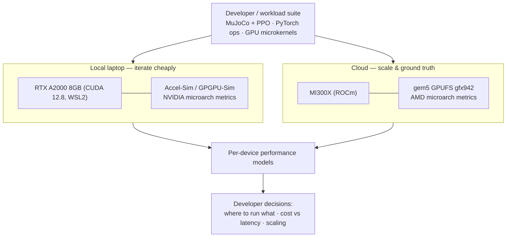
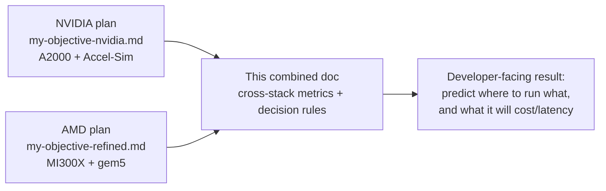

# Combined Cross-Stack Plan & Realistic Metrics — RTX A2000 vs MI300X

**Status:** Draft v1 · June 2026
**Companion docs:** `my-objective-refined.md` (AMD/ROCm + MI300X),
`my-objective-nvidia.md` (NVIDIA/CUDA + RTX A2000).

This document unifies both single-vendor plans and — most importantly —
gives **realistic, developer-useful metrics** for each device individually
and for the two as a combined dev environment. Numbers are vendor-spec
peaks plus order-of-magnitude estimates clearly labeled as such; treat them
as planning figures to be replaced by your own measured ground truth.

---

## 1. The combined setup

You have two devices at opposite ends of the compute spectrum:

- **Local laptop** — RTX A2000 8GB (Ampere, 65 W), i7 12th gen, 64 GB RAM,
  WSL2 + CUDA 12.8. Zero marginal cost, always available, small.
- **Cloud** — AMD Instinct MI300X (CDNA 3, 192 GB HBM3). Data-center scale,
  metered by the hour.

The natural division of labor — and the basis of this whole project — is:

**Workflow recommendation:** develop, debug, and iterate on the laptop
(free, fast feedback); burst to MI300X only for scale runs, large-model work,
and final ground-truth measurement (metered, so batch your runs).

## 2. Per-device specifications (side by side)

| Attribute | RTX A2000 8GB Laptop | MI300X | Ratio (MI300X / A2000) |
|---|---|---|---|
| Architecture | Ampere (GA107) | CDNA 3 (gfx942) | — |
| Compute units | 20 SMs / 2,560 CUDA cores | 304 CUs | ~10–20× cores |
| GPU memory | 8 GB GDDR6 | 192 GB HBM3 | **24×** |
| Memory bandwidth | ~0.19 TB/s (≈192 GB/s) | ~5.3 TB/s | **~28×** |
| FP32 peak | ~7 TFLOPS | 163.4 TFLOPS | **~23×** |
| FP16/BF16 (tensor) | ~64 TFLOPS dense | 1,307 TFLOPS | **~20×** |
| FP8 peak | not supported | 2,615 TFLOPS | — |
| Power | 65 W (TGP) | ~750 W (board) | ~11× |
| Cost model | Owned, ~free | Cloud $/hour | — |

> Numbers: A2000 figures are approximate and TGP-throttled; MI300X figures
> are AMD spec-sheet peaks (see `my-objective-refined.md` §7). Real achieved
> throughput is typically 40–70% of peak for well-tuned GEMM, far less for
> small/memory-bound robotics kernels.

## 3. Realistic workload metrics (planning estimates)

These are the metrics developers actually care about. **All figures are
order-of-magnitude planning estimates** pending your measured ground truth;
they encode the *shape* of the answer, not exact values.

### 3.1 Robotics policy inference — batch size 1 (the latency that matters)

A typical PPO control policy is a small MLP (e.g. 2–3 layers, ~256 units).
At batch 1 the GPU is almost idle; **latency is dominated by kernel-launch
and dispatch overhead, not compute** — so the tiny A2000 and the huge MI300X
land in the *same order of magnitude*.

| Metric | RTX A2000 | MI300X | Takeaway |
|---|---|---|---|
| Single-policy inference latency | ~50–200 µs | ~30–150 µs | Comparable — launch-bound, not FLOP-bound |
| GPU utilization at batch 1 | low (~5–15%) | negligible (<1%) | MI300X is wildly over-provisioned here |
| Throughput, 1 env | ~5k–20k inferences/s | ~7k–30k inferences/s | Similar; CPU↔GPU latency dominates |

**Developer insight:** for single-robot real-time inference, the laptop A2000
is *not meaningfully slower* than an MI300X. Buying data-center silicon for
batch-1 control is wasted money. The MI300X wins only when you batch.

### 3.2 Batched inference / vectorized environments (throughput regime)

When you run many parallel envs or batch many agents, compute starts to
matter and the scale gap opens up.

| Metric | RTX A2000 | MI300X | Takeaway |
|---|---|---|---|
| Max useful batch (small MLP) | ~hundreds (8 GB limit) | ~hundreds of thousands | Memory capacity 24× |
| Large-batch inference throughput | baseline 1× | ~20–28× | Tracks FLOP/bandwidth ratio |
| Sweet spot | edge / single robot / dev | fleet sim, RL at scale | Match device to batch size |

### 3.3 RL training (MuJoCo PPO)

Locomotion RL is often **CPU-bound in the physics sim**, so the GPU gap
shrinks at the application level — a crucial, counter-intuitive result.

| Metric | RTX A2000 (laptop) | MI300X (cloud) | Takeaway |
|---|---|---|---|
| Env steps/sec (CPU physics bound) | i7-limited | needs many CPU cores to feed it | GPU rarely the bottleneck |
| Time per policy-update GEMM | baseline | ~20× faster | Only matters with big nets/batches |
| Walker2d, 2M steps, wall-clock | hours (CPU-bound) | similar unless CPU scaled | Don't expect 20× end-to-end |

**Developer insight:** a 23× FLOP advantage does **not** mean 23× faster
training. End-to-end speedup is gated by the CPU physics and data pipeline.
This is exactly the simulation-to-real *performance-estimation* gap the
project quantifies.

### 3.4 Model capacity (what fits at all)

| Workload | RTX A2000 8 GB | MI300X 192 GB |
|---|---|---|
| Robotics control policies | ✅ easily | ✅ trivially |
| Vision backbone (ResNet/ViT) inference | ✅ | ✅ |
| 7B LLM inference (FP16) | ❌ (needs ~14 GB) | ✅ (×many) |
| 7B LLM, 4-bit quantized | ⚠️ tight (~4–5 GB) | ✅ |
| 70B+ LLM | ❌ | ✅ |
| Large-batch training | ❌ OOM quickly | ✅ |

## 4. Combined metrics useful for developers

Beyond per-device numbers, the *combination* yields decision-grade metrics:

| Combined metric | What it tells a developer | How to compute |
|---|---|---|
| **Latency parity point** | batch size where MI300X starts beating A2000 on latency | sweep batch size on both; find crossover |
| **Cost-per-1M-inferences** | $ on cloud MI300X vs ~free laptop | (cloud $/hr) ÷ (inferences/hr); A2000 ≈ electricity only |
| **Speedup efficiency** | achieved speedup ÷ theoretical 23× | end-to-end MI300X time vs A2000, normalized |
| **CPU-bound fraction** | how much of training the GPU can't help | profile CPU vs GPU busy time |
| **Roofline position** | is a kernel compute- or memory-bound | arithmetic intensity vs each device's ridge point |
| **Dev-to-prod fidelity** | how well laptop results predict MI300X | the project's core ±20% prediction error |

### Suggested developer decision rule (from the metrics above)

1. **Prototype & debug on the A2000.** Free, instant, big enough for policies.
2. **Profile to find your regime** — batch-1/latency-bound vs batched/compute-
   bound vs CPU-bound.
3. **Only burst to MI300X** for: large batches, large models, or final
   ground-truth/scaling numbers. For single-robot latency, you likely don't
   need it at all.
4. **Use the prediction model** to estimate MI300X performance from laptop +
   simulation metrics *before* spending cloud hours — that is the deliverable
   that makes this whole setup pay for itself.

## 5. How the three plans fit together

- The two single-vendor plans share **one workload suite**, so their results
  are directly comparable.
- This document is where their measured numbers get combined into the
  cross-stack metrics and decision rules above.
- Validation target across all three: predict the other device's / real
  hardware's performance within **±20%** on held-out workloads.

## 6. Caveats on the numbers

- Every figure marked "~" is a planning estimate, not a benchmark. Replace
  with measured values as Path 3 ground truth comes in.
- Peak TFLOPS are marketing ceilings; robotics workloads realize a small
  fraction, especially at batch 1.
- The A2000's 65 W cap means sustained-load clocks (and thus real TFLOPS)
  are lower than burst — log achieved clocks.
- Cross-simulator numbers (gem5 vs Accel-Sim) are **not** directly
  comparable; only real-hardware (Path 3) numbers compare across vendors.

## Sources

- MI300X spec sheet: https://www.amd.com/content/dam/amd/en/documents/instinct-tech-docs/data-sheets/amd-instinct-mi300x-data-sheet.pdf
- RTX A2000 Laptop GPU specs: https://www.notebookcheck.net/NVIDIA-RTX-A2000-Laptop-GPU-GPU-Benchmarks-and-Specs.532536.0.html
- Accel-Sim: https://accel-sim.github.io/
- gem5 AMD GPU models: https://www.gem5.org/documentation/general_docs/gpu_models/gpufs
