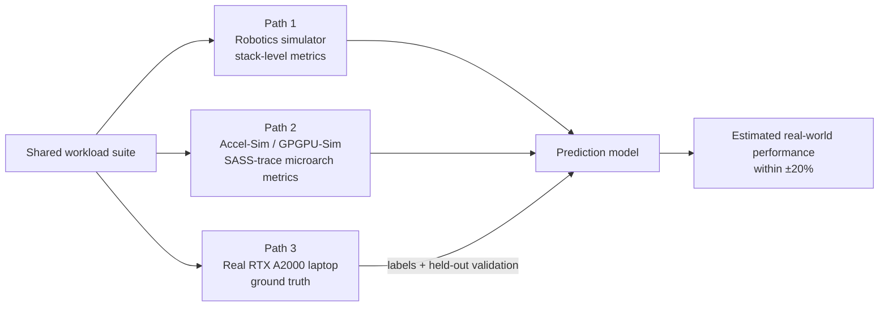

# NVIDIA Configuration Plan — Performance Estimation on the CUDA Stack

**Status:** Draft v1 · June 2026
**Scope note:** This is the NVIDIA/CUDA counterpart to the AMD/ROCm plan in
`my-objective-refined.md`. Same objective, methodology, and success criterion;
only the hardware, software stack, and architectural simulator change.

---

## 1. Why a separate NVIDIA plan

The core research question — *estimate real-world compute performance of
robotics workloads from simulation* — is vendor-independent, but the tooling
is not. Two facts force a different plan on the NVIDIA side:

1. **gem5 does not model NVIDIA GPUs.** gem5's GPU model is AMD-only. The
   NVIDIA architectural-simulation path must use **Accel-Sim / GPGPU-Sim 4.0**
   (trace-driven simulation of NVIDIA's SASS ISA via NVBit), which is a
   different workflow from gem5's GPUFS.
2. **The available NVIDIA hardware is small and local.** The target is a
   personal laptop, not a data-center accelerator. This is a feature for
   *iteration speed* but a constraint on *workload size* — and it makes the
   cross-stack comparison with MI300X interesting precisely because the two
   devices are at opposite ends of the scale.

## 2. Available NVIDIA hardware

| Component | Spec (confirmed via `nvidia-smi`) |
|---|---|
| GPU | NVIDIA RTX A2000 8GB Laptop GPU (Ampere, GA107) |
| GPU memory | 8 GB (8192 MiB) GDDR6, 128-bit bus |
| CUDA cores | 2,560 |
| Tensor cores | 80 (3rd gen) |
| FP32 peak | ~7 TFLOPS (constrained by the 65 W cap below; approximate) |
| Power cap (TGP) | **65 W** |
| Driver / CUDA | Driver 573.91, **CUDA 12.8** |
| OS environment | **WSL2** (Linux userspace on Windows; `/mnt/d/...`) |
| CPU | Intel Core i7, 12th gen |
| System RAM | 64 GB |

**WSL2 note:** CUDA, PyTorch, and Nsight all work under WSL2 with this driver,
and NVBit tracing for Accel-Sim is supported — but expect occasional rough
edges (profiler permissions, `/dev` access). If a tool misbehaves, a native
Linux dual-boot is the fallback. The 65 W TGP also means clocks throttle under
sustained load, so **always log achieved clocks** alongside timings.

The 8 GB VRAM is the binding constraint: it comfortably holds robotics policy
networks and small operator benchmarks, but not large-model training. That is
fine — robotics control policies are small, and this project is about latency
and utilization, not training trillion-parameter models.

## 3. Objective (unchanged)

Measure fine-grained performance of robotics workloads across the CUDA stack
without needing exotic hardware, then estimate real-world metrics
(end-to-end latency, throughput) on the **RTX A2000 laptop** and validate
against measured ground truth.

**Success criterion:** predict policy-inference latency (batch size 1) and
training throughput (environment steps/second) on the RTX A2000 within
**±20%**, validated on held-out workloads.

## 4. Approach

### 4.1 High level

Same three-path structure as the AMD plan. The only substitutions are the
software stack (CUDA instead of ROCm) and the architectural simulator
(Accel-Sim instead of gem5).

### 4.2 Technical details — tools (open source preferred)

| Component | Tool | Note |
|---|---|---|
| Robot simulation | MuJoCo + Gymnasium | Apache 2.0; identical workloads to AMD plan |
| Learning framework | PyTorch (CUDA build) | Same Python code as the ROCm build |
| Architectural simulation | Accel-Sim + GPGPU-Sim 4.0 | BSD-style; trace-driven NVIDIA SASS modeling |
| Trace generation | NVBit | NVIDIA binary instrumentation; runs on the A2000 itself |
| GPU microbenchmarks | BabelStream (CUDA), custom CUDA kernels | HIP source hipify-able both ways |
| Profiling | Nsight Compute, Nsight Systems, `torch.utils.benchmark` | Vendor tools, free |

### 4.3 Sample workloads (identical to the AMD plan, for comparability)

1. **CUDA microkernels** — vector copy, reduction, GEMM at several sizes.
   Small enough to trace and simulate in Accel-Sim.
2. **PyTorch operator benchmarks** — the linear layers, activations, and
   batched GEMMs of the control policy, at real tensor shapes.
3. **PPO locomotion training and inference** — walker/humanoid in MuJoCo;
   physics on CPU, policy training and batch-1 inference on the A2000.

Keeping the workload suite byte-for-byte the same across both plans is what
makes the eventual cross-stack comparison valid.

## 5. Operationalization

1. **Weeks 1–2 — Baseline.** MuJoCo + Gymnasium + PyTorch (CUDA) on the
   laptop; train PPO on Walker2d; lock the policy tensor shapes.
2. **Weeks 3–4 — Path 1.** Instrument stack layers; build the measurement
   harness (pinned clocks via `nvidia-smi -lgc`, warmup,
   `torch.cuda.synchronize()` before timing, 30+ runs, median + spread).
3. **Weeks 5–7 — Path 2.** Install NVBit; generate SASS traces of the
   microkernels and operator-sized kernels; run them through Accel-Sim;
   extract IPC, L1/L2 hit rates, DRAM traffic, warp occupancy, SM utilization.
4. **Weeks 8–9 — Path 3.** Run the full suite on the RTX A2000 with the same
   harness; profile per-kernel with Nsight Compute.
5. **Weeks 10–12 — Prediction and validation.** Fit feature→ground-truth
   models; compose kernel estimates into application estimates; evaluate on
   held-out workloads; iterate where error exceeds ±20%.

Resource envelope: everything runs on the single laptop (i7 12th gen, 64 GB
RAM, RTX A2000) — no cloud needed. Accel-Sim simulation is CPU-bound and
single-threaded; expect minutes-to-hours per traced kernel.

## 6. Key differences vs the AMD/ROCm plan

| Dimension | AMD plan (MI300X) | NVIDIA plan (RTX A2000) |
|---|---|---|
| Real hardware | Cloud data-center accelerator | Local laptop GPU |
| Arch simulator | gem5 GPUFS (runs real driver) | Accel-Sim (trace-driven, needs the GPU to trace) |
| Sim approach | Executes kernels in full-system sim | Replays recorded SASS traces |
| Scale regime | Massively over-provisioned for robotics | Right-sized / sometimes memory-bound |
| Cost | Cloud GPU hours | Already owned, zero marginal cost |

## 7. Expected results

The same four artifacts as the AMD plan — measurement harness, feature/ground-
truth dataset, prediction model within ±20% on held-out workloads, and an
Accel-Sim-based "what-if" methodology — but for the CUDA stack. Crucially,
because the workload suite is shared, these results slot directly into the
combined cross-stack analysis (`my-objective-combined.md`).

## Sources

- Accel-Sim framework: https://accel-sim.github.io/
- GPGPU-Sim 4.0: https://github.com/accel-sim/gpgpu-sim_distribution
- NVIDIA RTX A2000 Laptop GPU specs: https://www.notebookcheck.net/NVIDIA-RTX-A2000-Laptop-GPU-GPU-Benchmarks-and-Specs.532536.0.html
- NVIDIA RTX A2000 datasheet: https://www.nvidia.com/content/dam/en-zz/Solutions/design-visualization/rtx-a2000/nvidia-rtx-a2000-datasheet.pdf
