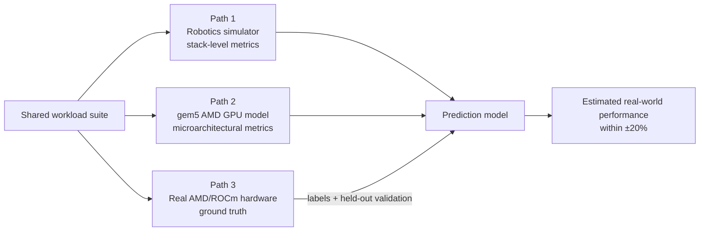

# Estimating Real-World Compute Performance of Robotics Workloads from Simulation

**Status:** Draft v1 · June 2026
**Scope note:** This phase targets the AMD/ROCm stack only. NVIDIA/CUDA is
deferred to a later phase.

---

## 1. Business Goal

Physical AI products (robots, autonomous systems) succeed or fail on whether
their control software meets real-time performance budgets on the compute
hardware actually deployed in the field. Today, validating this requires
buying and provisioning every candidate hardware platform — slow, expensive,
and late in the development cycle.

**The business goal is to reduce the cost and lead time of hardware
selection and deployment validation for robotics workloads, by making
real-world performance estimable from simulation before hardware is
acquired.** A team that can predict "this control policy will run at X ms
latency on platform Y within ±20%" from simulation alone can shortlist
hardware earlier, negotiate from data, and catch deployment blockers before
integration.

## 2. Project Objective

Address the simulation-to-real gap on its **compute-performance dimension**:
a workload that behaves well in a robotics simulator gives no indication of
how it will perform on real deployment hardware. This project closes that
gap in two steps:

1. **Thoroughly measure fine-grained performance** of a robotics workload
   across the full compute stack — from the application layer down to
   microarchitectural behavior — using simulation environments that do not
   require the target hardware.
2. **Use those fine-grained measurements to estimate real-world metrics**
   (end-to-end latency, throughput) on the physical AMD/ROCm platform, and
   validate the estimates against measured ground truth.

**Success criterion:** predict policy-inference latency (batch size 1) and
training throughput (environment steps/second) on a real AMD GPU within
**±20%**, validated on workloads held out from model fitting.

## 3. Approach

### 3.1 High level

One shared workload suite is measured along three paths. Two paths produce
*features* without needing the target GPU; the third produces *ground truth*
on real hardware. A prediction model maps features to ground truth and is
validated on held-out workloads.

### 3.2 Technical details

**Tools (open source preferred):**

| Component | Tool | License / note |
|---|---|---|
| Robot simulation | MuJoCo + Gymnasium | Apache 2.0; standard walker/humanoid locomotion tasks |
| Learning framework | PyTorch (ROCm build) | BSD; same code path as CUDA, keeping a later NVIDIA phase cheap |
| Architectural simulation | gem5 (GPUFS, VEGA_X86) | BSD; official AMD GPU models (Vega, MI210, MI300X) running real ROCm 6.x |
| GPU microbenchmarks | BabelStream, custom HIP kernels | Open source; HIP keeps source portable |
| Profiling | rocprofiler, `torch.utils.benchmark`, gem5 stats | Open source / vendor-provided |

**Sample workloads (small → large):**

1. **HIP microkernels** — vector copy, reduction, GEMM at several sizes.
   Small enough to run in gem5; they anchor the microarchitectural features.
2. **PyTorch operator benchmarks** — the linear layers, activations, and
   batched GEMMs that a control policy is actually made of, at the policy's
   real tensor shapes.
3. **PPO locomotion training and inference** — a walker/humanoid agent in
   MuJoCo. Physics runs on CPU; the GPU work is policy training and batch-1
   inference. This is the application-level workload whose real-world
   performance we ultimately estimate.

## 4. Operationalization

1. **Weeks 1–2 — Baseline workload.** Stand up MuJoCo + Gymnasium + PyTorch;
   train PPO on Walker2d; define the exact policy shapes that parameterize
   all other workloads.
2. **Weeks 3–4 — Fine-grained measurement, Path 1.** Instrument the stack
   layers (application timing, framework operator profiles, runtime/driver
   counters via rocprofiler); build the automated measurement harness
   (pinned clocks, warmup, synchronize-before-timing, 30+ runs, median +
   spread).
3. **Weeks 5–7 — Fine-grained measurement, Path 2.** Build gem5 VEGA_X86
   (Docker toolchain), validate in GPUSE mode with HIP samples, then run the
   microkernels and operator-sized kernels in GPUFS on the MI210/MI300X
   models; extract IPC, cache hit rates, memory traffic, occupancy.
4. **Weeks 8–9 — Ground truth, Path 3.** Run the full suite on a real AMD
   GPU (local RX 7900-class card, or MI300X cloud hours) with the same
   harness.
5. **Weeks 10–12 — Prediction and validation.** Fit regression models from
   Path 1+2 features to Path 3 labels; compose kernel-level estimates into
   application-level estimates; evaluate on held-out workloads; iterate on
   features where error exceeds ±20%.

Resource envelope: one Linux machine (16 cores, 32–64 GB RAM, ~150 GB free
disk) covers Paths 1–2; one AMD GPU (or ~$50 of cloud hours) covers Path 3.

## 5. Expected Results

1. An **open measurement harness** producing layered, reproducible
   performance profiles of robotics workloads on the ROCm stack.
2. A **dataset** pairing simulation-derived features with real-hardware
   ground truth across the workload suite.
3. A **prediction model** estimating real-world latency/throughput within
   ±20% on held-out workloads — plus an analysis of *which stack layers
   carry the most predictive signal*, which is a useful result even where
   the ±20% target is missed.
4. A documented gem5-based methodology for asking "what if the hardware had
   more compute units / larger caches?" without owning that hardware.

## 6. Benefit

- **Earlier, cheaper hardware decisions:** deployment performance becomes a
  simulation-time question, not a procurement-time discovery.
- **De-risked deployment:** latency-budget violations surface before
  integration on the physical robot.
- **Vendor-extensible foundation:** because the workload code (PyTorch/HIP)
  is portable, adding the NVIDIA/CUDA path later requires only the
  ground-truth and simulator backends, not a new methodology.
- **Skills and artifacts that compound:** the harness, dataset, and gem5
  workflow are each independently reusable for future architecture and
  benchmarking studies.
