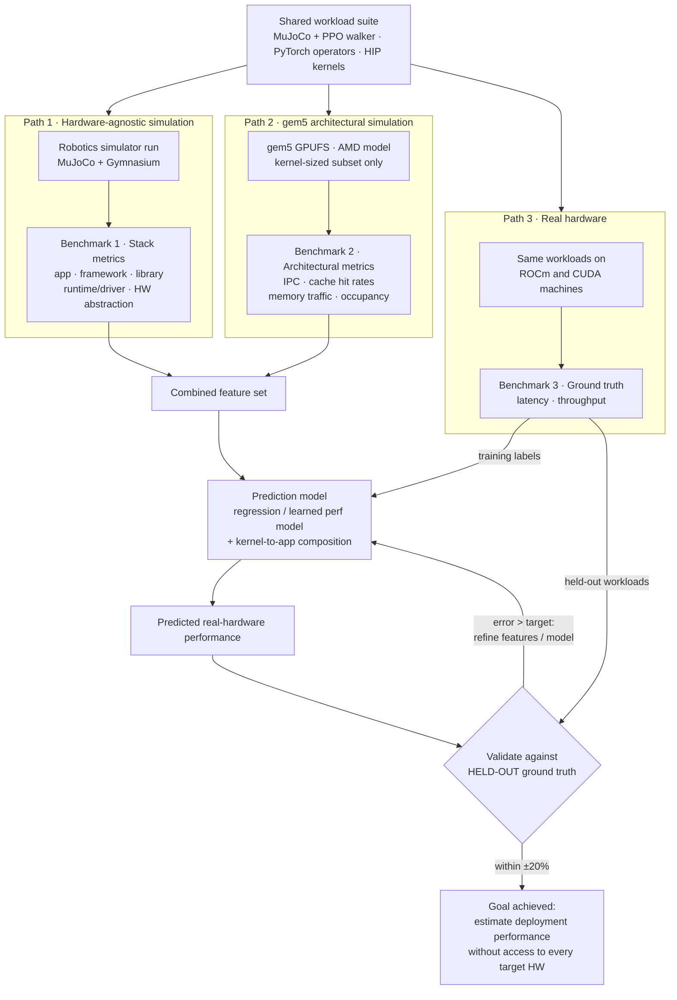

# Objective: Predicting Real-Hardware Performance of Robotics Workloads from Simulation

## One-sentence objective

Build a pipeline that predicts the real-hardware performance (latency,
throughput) of robotics workloads from simulation-derived metrics, so that
deployment performance on a target compute stack can be estimated without
physical access to every target.

## A precision note on framing

In Physical AI, "simulation-to-real gap" usually means the *policy transfer*
gap — a controller trained in simulated physics fails on a real robot because
of dynamics/perception mismatch. What this project addresses is different and
should be named precisely: the **performance-estimation (deployment) gap** —
"will my policy meet its latency budget on the robot's actual compute
hardware, and can I know that before buying/deploying it?" Naming it this way
keeps reviewers from expecting domain-randomization work, and it is a real,
underexplored problem (hardware-software co-design for robotics).

## The plan

1. **Benchmark 1 — Hardware-agnostic stack metrics.**
   Run a benchmark workload suite (MuJoCo + Gymnasium walker task driven by a
   PyTorch PPO agent, plus PyTorch operator benchmarks and HIP/CUDA
   microbenchmarks) and collect metrics at every layer:
   application → framework → libraries → runtime/driver → hardware abstraction.

2. **Benchmark 2 — gem5 architectural metrics.**
   Run the kernel-sized subset of the same workloads in gem5 (GPUFS, AMD
   Vega/MI210/MI300X models) to obtain low-level metrics: IPC, cache hit
   rates, memory traffic, occupancy, pipeline behavior.
   *Constraints to stay honest about:* gem5 models **AMD GPUs only** (the
   NVIDIA side needs Accel-Sim or CPU-side proxies), and gem5 runs
   **kernels, not applications** (~10,000×+ slowdown).

3. **Benchmark 3 — Real-hardware ground truth.**
   Run the full suite on actual hardware (AMD ROCm and NVIDIA CUDA machines)
   using the controlled methodology (pinned clocks, warmup, synchronize,
   30+ runs, median + spread).

4. **Prediction model.**
   Use features from Benchmarks 1 + 2 to predict Benchmark 3. Start with
   simple regression over (workload features × architectural metrics) before
   reaching for anything novel — the genuinely novel part is **composition**:
   gem5 gives kernel-level predictions; real workloads are sequences of
   kernels plus CPU work, so the model must compose kernel estimates into
   application-level estimates. Related prior work to read: learned
   performance models (e.g. Ithemal), gem5 validation/calibration studies,
   roofline-model-based estimation.

## Success criteria (measurable)

- Predict policy-inference latency (batch 1) and training throughput
  (steps/sec) on a real GPU within **±20%**, using only simulation-derived
  features.
- Validation must use a **held-out workload set** — workloads the model never
  saw during fitting. Predicting workloads you trained on proves nothing.
- Report where the prediction breaks down (which layer's metrics carry the
  most signal) — a negative result here is still a contribution.

## Workflow diagram

## How to read the diagram

- One workload suite feeds **three independent measurement paths** — that's
  what keeps the experiment controlled.
- Paths 1 and 2 produce **features**; Path 3 produces **labels**. The
  prediction model learns the mapping.
- The validation diamond is the heart of the project: ground truth is split
  into training labels and a held-out set, and the error arrow looping back
  into the model is where the actual research iteration happens.
