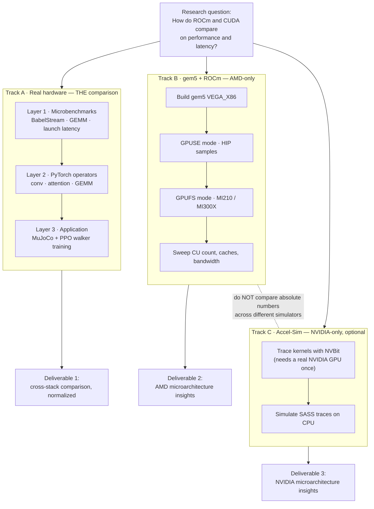
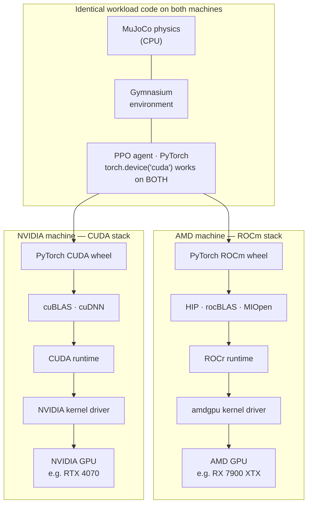
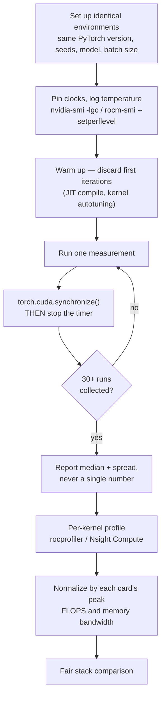
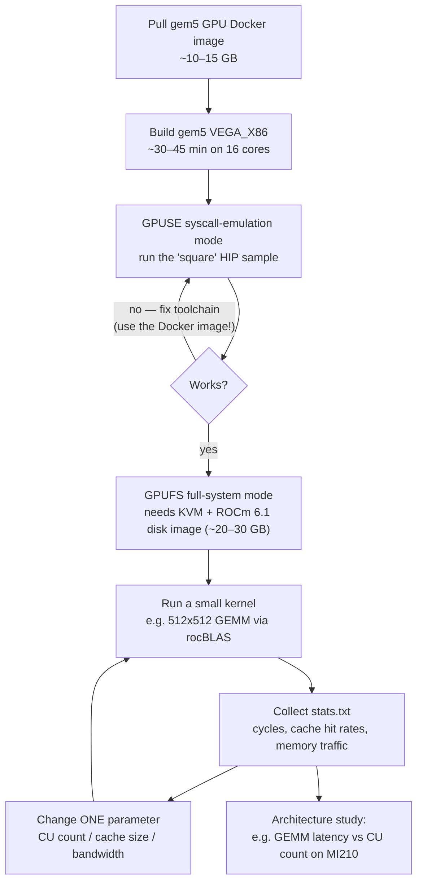
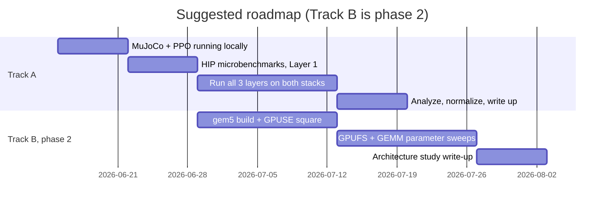

# Visual Guide — How Everything Fits Together

Companion to `benchmarking-rocm-vs-cuda-guide.md`. View in VS Code markdown
preview or on GitHub to see the rendered diagrams.

## 1. The big picture — three tracks, one research question

The key insight: Track A is the *only* place ROCm and CUDA are directly
compared. Tracks B and C are separate, single-vendor microarchitecture
studies — never compare absolute numbers between two different simulators.

## 2. The controlled experiment — same code, two stacks

Why MuJoCo + PyTorch makes a fair benchmark: physics runs on the CPU
(identical on both machines), and the same Python code drives either GPU
stack. The only thing that changes between machines is everything below the
PyTorch wheel.

## 3. The measurement loop — what makes it "controlled"

Every number you report should have gone through this loop. The synchronize
step is the one beginners miss: GPU launches are asynchronous, so timing
without it measures nothing.

## 4. The gem5 experiment loop — architecture exploration

This is what gem5 buys you that real hardware can't: change the architecture,
rerun the same kernel. Note the two modes — start in GPUSE (simpler, no KVM),
graduate to GPUFS (real driver, needs KVM on bare-metal Linux).

## 5. Suggested roadmap

## How to read these together

1. Diagram 1 is the map — three independent tracks, three deliverables.
2. Diagram 2 explains *why* Track A is a fair experiment.
3. Diagram 3 is the procedure you repeat for every measurement in Track A.
4. Diagram 4 is the procedure for Track B.
5. Diagram 5 is when to do what.
